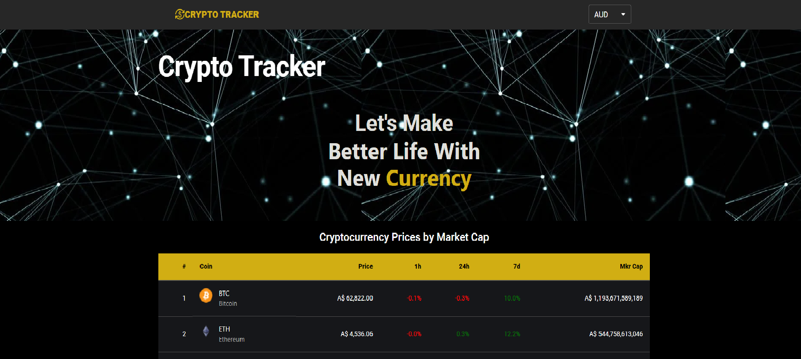
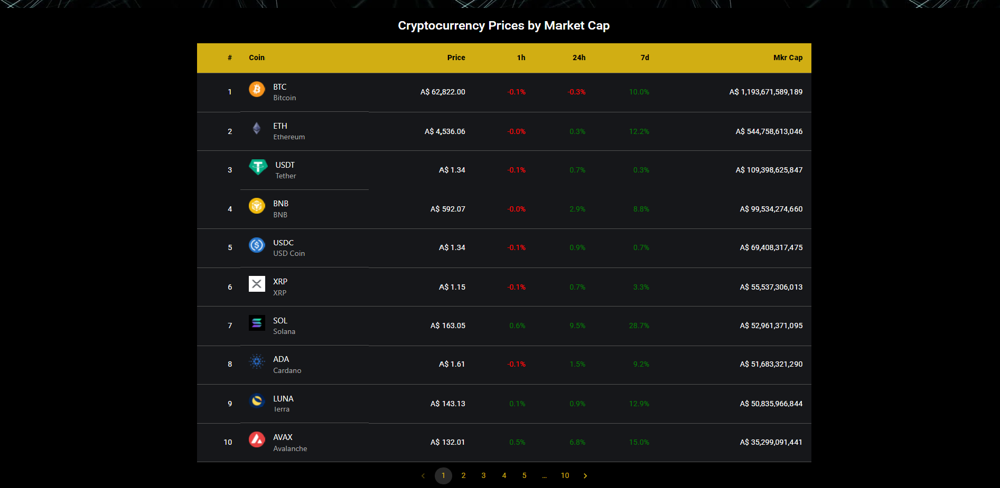

# CryptoTracker
CryptoTracker application is built on react js that will let users to track all cryptocurrency list via market cap with prices difference in 1h, 24h and 7d range in AUD and USD currencies

## Application URL
https://main.d2lpjdsu5y0dab.amplifyapp.com/

## How to run the application
1. Clone the application or fork.
2. Install all dependencies using `npm i` command
3. Start the server with `npm start` command
4. Go to http://localhost:300 on your browser and start using the application

## API Source Doc
 https://www.coingecko.com/en/api/documentation

## User stories
- A user can view list of all cryptocurrencies
- A user can change the currency between 'AUD' and 'USD'
- A user can navigate to different pages to view multiple cryptocurrencies

## Frontend Dependencies
- Node
- React
- Material UI
- Axios

## What the app looks like 

